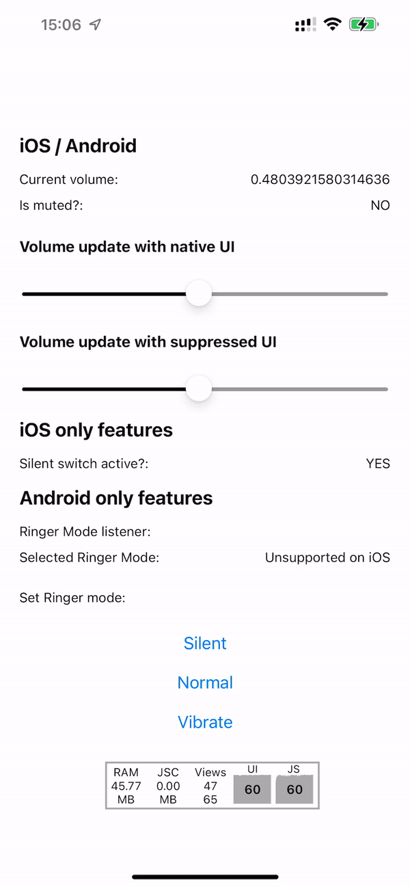
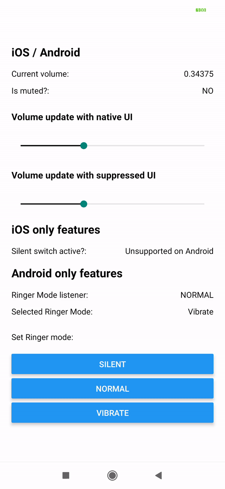

# react-native-volume-manager

Enhance system volume control on iOS and Android with this native package. Adjust the volume, monitor changes, and create custom volume sliders and user experiences. The package provides an intuitive API for accessing the current volume level, detecting the silent switch status (iOS), and tracking ringer mode changes (Android).

|  |  |
| ----------------------------------------------- | --------------------------------------------------- |

## Features

- Adjust system volume
- Monitor volume changes
- Suppress default volume UI
- Access current volume level
- Detect silent switch status (iOS)
- Enable/disable audio session and change category (iOS)
- Track ringer mode changes (Android)

## Installation

Using npm:

```sh
npm install react-native-volume-manager
```

Using Yarn:

```sh
yarn add react-native-volume-manager
```

For React Native >= 0.60, manual linking is not required with Autolinking.

> Note: This library is incompatible with Expo Go. To use it, you can install a custom development client as recommended in 2023.

## Simulators / Emulators

- iOS: The AVAudioSession API offers control over audio behaviors and settings on iOS devices. However, some hardware-specific features of AVAudioSession, such as volume control and audio route selection, don't have equivalent functionalities on macOS, which the simulator runs on. As a result, this package operates only on a real device, with events not being triggered on the simulator.
- Android: It runs on both a real device (API level 21+) and the emulator (API level 33+).

## Usage

All methods are available under the `VolumeManager` namespace or can be imported directly. Here are some examples:

```tsx
import { VolumeManager } from 'react-native-volume-manager';

// Disable the native volume toast globally (iOS, Android)
VolumeManager.showNativeVolumeUI({ enabled: true });

// Set the volume (value between 0 and 1)
await VolumeManager.setVolume(0.5);

// Get the current volume async
const { volume } = await VolumeManager.getVolume();

// Listen to volume changes
const volumeListener = VolumeManager.addVolumeListener((result) => {
  console.log(result.volume);

  // On Android, additional volume types are available:
  // music, system, ring, alarm, notification
});

// Remove the volume listener
volumeListener.remove();
```

For more usage examples and detailed API documentation, please refer to the [GitHub repository](https://github.com/your-repo).

## iOS Audio Session Management

This section provides methods related to AVAudioSession on iOS. For example:

```tsx
import { VolumeManager } from 'react-native-volume-manager';

// Enable or disable iOS AudioSession
VolumeManager.enable(true, true); // Enable async
VolumeManager.enable(false, true); // Disable async, non-blocking

// Activate or deactivate the audio session
VolumeManager.setActive(true, true); // Activate async
VolumeManager.setActive(false, true); // Deactivate async, non-blocking
```

## iOS Mute Switch Listener

To monitor the mute switch status on iOS, you can use the following:

```tsx
import { VolumeManager } from 'react-native-volume-manager';

const silentListener = VolumeManager.addSilentListener((status) => {
  console.log(status.isMuted);
  console.log(status.initialQuery);
});

// Remove the silent listener
silentListener.remove();
```

## Android Ringer Listener

To listen to ringer mode changes on Android, you can use the following:

```tsx
import { VolumeManager } from 'react-native-volume-manager';

const ringerListener = VolumeManager.addRingerListener((status) => {
  console.log(status.ringerMode);
});

// Remove the ringer listener
VolumeManager.removeRingerListener(ringerListener);
```

## useSilentSwitch hook

`useSilentSwitch` is a custom React hook that monitors the silent switch on an iOS device. The nativeIntervalCheck parameter (optional) allows you to set the interval at which the silent switch status is checked in seconds. If the parameter is not provided, a default interval is used (2.0).

The hook returns an object with two properties: isMuted (which represents the ring/mute switch position) and initialQuery (which indicates whether the reported status is the first one after the application launch). On non-iOS platforms or for the first call, the hook returns undefined. This hook is only applicable to iOS.

```tsx
import React from 'react';
import { View, Text } from 'react-native';
import { useSilentSwitch } from 'react-native-volume-manager';

export default function App() {
  const status = useSilentSwitch();

  return (
    <View>
      <Text>Silent Switch Status:</Text>
      {status ? (
        <View>
          <Text>Is Muted: {status.isMuted ? 'YES' : 'NO'}</Text>
          <Text>Is Initial Query: {status.initialQuery ? 'YES' : 'NO'}</Text>
        </View>
      ) : (
        <Text>Fetching...</Text>
      )}
    </View>
  );
}
```

In this example, `useSilentSwitch` is used to monitor the status of the silent switch on iOS devices. The status of the switch (`isMuted`) and whether it's the initial query (`initialQuery`) are displayed. If the status is not available yet, "Fetching..." is displayed.

### useRingerMode Hook

You can use the `useRingerMode` hook to get and set the ringer mode on Android:

```tsx
import React from 'react';
import { View, Text, Button } from 'react-native';
import {
  useRingerMode,
  RINGER_MODE,
  RingerModeType,
} from 'react-native-volume-manager';

const modeText = {
  [RINGER_MODE.silent]: 'Silent',
  [RINGER_MODE.normal]: 'Normal',
  [RINGER_MODE.vibrate]: 'Vibrate',
};

export default function App() {
  const { mode, error, setMode } = useRingerMode();

  return (
    <View>
      <Text>Ringer Mode: {mode !== undefined ? modeText[mode] : null}</Text>

      <View>
        <Button title="Silent" onPress={() => setMode(RINGER_MODE.silent)} />
        <Button title="Normal" onPress={() => setMode(RINGER_MODE.normal)} />
        <Button title="Vibrate" onPress={() => setMode(RINGER_MODE.vibrate)} />
      </View>

      <View>
        <Text>{error?.message}</Text>
      </View>
    </View>
  );
}
```

## API

The `VolumeManager` API provides an interface for controlling and observing volume settings on iOS and Android devices. The API is designed to offer a consistent experience across both platforms where possible, with some platform-specific functionality provided where necessary.

### Cross-platform methods:

- `showNativeVolumeUI(config: { enabled: boolean }): Promise<void>`: This asynchronous function allows you to control the visibility of the native volume UI when volume changes occur.

- `getVolume(): Promise<VolumeResult>`: Asynchronously fetches the current volume level and returns a promise that resolves to an object, `VolumeResult`, containing the current volume information.

- `setVolume(value: number, config?: VolumeManagerSetVolumeConfig): Promise<void>`: Allows you to programmatically adjust the device's volume level. The `value` parameter should be between 0 and 1, and `config` parameter is an optional object for additional configuration settings.

- `addVolumeListener(callback: (result: VolumeResult) => void): EmitterSubscription`: Allows you to add a listener that will be called when the device's volume changes. The listener receives an object, `VolumeResult`, that contains the updated volume information.

### iOS-only methods:

- `enable(enabled: boolean, async: boolean): Promise<void>`: Enables or disables the audio session. Enabling the audio session sets the session's category to 'ambient', allowing it to mix with other audio.

- `setActive(value: boolean, async: boolean): Promise<void>`: Activates or deactivates the audio session. Deactivating the session reactivates any sessions that were interrupted by this one.

- `setCategory(value: AVAudioSessionCategory, mixWithOthers?: boolean): Promise<void>`: Sets the category for the AVAudioSession in your iOS app. `mixWithOthers` is an optional parameter that, if true, allows your audio to mix with audio from other apps.

- `setMode(mode: AVAudioSessionMode): Promise<void>`: Sets the mode for the AVAudioSession in your iOS app.

- `enableInSilenceMode(value: boolean): Promise<void>`: If value is true, this function allows your app to play audio even when the device is in silent mode. When value is false, audio will not play in silent mode.

- `setNativeSilenceCheckInterval(value: number)`: Sets the interval at which the native system checks the state of the silent switch.

- `addSilentListener(callback: RingMuteSwitchEventCallback): EmitterSubscription | EmitterSubscriptionNoop`: Adds a listener that will be called when the silent switch state changes.

### Android-only methods:

- `getRingerMode(): Promise<RingerModeType | undefined>`: Asynchronously fetches the current ringer mode of the device (silent, vibrate, or normal).

- `setRingerMode(mode: RingerModeType): Promise<RingerModeType | undefined>`: Sets the device's ringer mode.

- `isRingerListenerEnabled(): Promise<boolean>`: Asynchronously checks whether a ringer mode listener is enabled.

- `addRingerListener(callback: RingerEventCallback): EmitterSubscription | EmitterSubscriptionNoop`: Adds a listener that will be called when the ringer mode changes.

- `removeRingerListener(listener: EmitterSubscription | EmitterSubscriptionNoop): void`: Removes a previously added ringer mode listener.

- `checkDndAccess(): Promise<boolean | undefined>`: Asynchronously checks if 'Do Not Disturb' access has been granted.

- `requestDndAccess(): Promise<boolean | undefined>`: Initiates a request for 'Do Not Disturb' access.

Please note that while this API tries to provide a consistent experience across both platforms, some methods are platform-specific due to the differences in how iOS and Android handle

## Contributing

See the [contributing guide](CONTRIBUTING.md) to learn how to contribute to the repository and the development workflow.

## Special thanks

- Uses code from https://github.com/c19354837/react-native-system-setting
- Uses code from https://github.com/zmxv/react-native-sound
- Uses code from https://github.com/vitorverasm/react-native-silent
- Uses code from https://github.com/GeorgyMishin/react-native-silent-listener
- Fully implements https://github.com/reyhankaplan/react-native-ringer-mode

I used parts, or even the full source code, of these libraries (with plenty of adjustments and rewrites to TypeScript) to make this library work on Android and iOS and to have a mostly unified API that handles everything related to volume. Since many of the packages I found were unmaintained or abandoned and only solved some of the issues, I decided to create my own. I hope you don't mind it and find it useful!

## License

MIT
