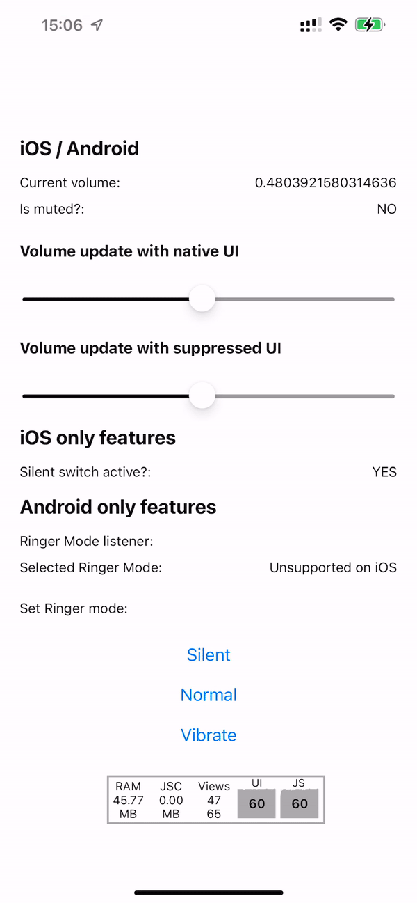
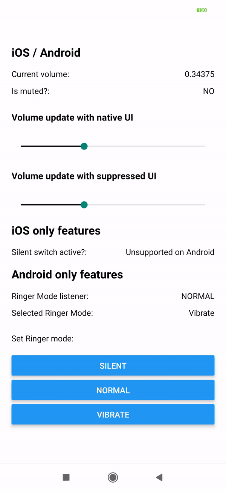

# react-native-volume-manager

Control and observe system volume from React Native on iOS and Android.

Use it to read the current volume, set volume, listen for volume changes, hide the native volume UI for custom controls, detect the iOS silent switch, and work with Android ringer mode.

|  |  |
| ----------------------------------------------- | --------------------------------------------------- |

## Features

- Read and set system volume.
- Listen for volume changes.
- Hide the native volume UI when building a custom slider.
- Detect the iOS silent switch.
- Manage iOS audio session state and category.
- Read, set, and observe Android ringer mode.
- Check and request Android Do Not Disturb access.

## Requirements

- React Native 0.85 or newer is recommended.
- iOS 15.0 or newer.
- Android min SDK 24.
- New Architecture projects are the supported path.
- Expo requires a custom development build. Expo Go is not supported.

The example app is kept on Expo SDK 56 and React Native 0.85.

## Installation

```sh
yarn add react-native-volume-manager
```

or:

```sh
npm install react-native-volume-manager
```

Install pods after adding the package:

```sh
cd ios && pod install
```

For Expo projects, use a development build:

```sh
npx expo prebuild
npx expo run:ios
npx expo run:android
```

If your Expo app targets iOS below 15.0, raise the deployment target with `expo-build-properties`:

```json
[
  "expo-build-properties",
  {
    "ios": {
      "deploymentTarget": "15.0"
    }
  }
]
```

## Platform Notes

### iOS

Volume control and silent-switch detection require a physical device. The iOS simulator does not expose hardware volume or silent-switch behavior.

### Android

Volume control works on emulators and physical devices. Ringer mode and Do Not Disturb behavior can vary by Android version, OEM settings, and granted permissions.

When `showNativeVolumeUI({ enabled: false })` is used, the module intercepts hardware volume keys while the app is foregrounded so you can build a custom volume UI.

### Web

Web is intentionally a no-op. The package can be imported on web, but native volume APIs are not available in browsers.

## Quick Start

```tsx
import { VolumeManager } from 'react-native-volume-manager';

// Read the current volume.
const { volume } = await VolumeManager.getVolume();

// Set the music volume to 50%.
await VolumeManager.setVolume(0.5);

// Hide the native volume UI for custom controls.
await VolumeManager.showNativeVolumeUI({ enabled: false });

// Restore the native volume UI.
await VolumeManager.showNativeVolumeUI({ enabled: true });

// Listen for volume changes.
const listener = VolumeManager.addVolumeListener((result) => {
  console.log(result.volume, result.type);
});

listener.remove();
```

On Android, `result.type` can be `music`, `call`, `system`, `ring`, `alarm`, or `notification`.

## Set a Specific Android Volume Stream

```tsx
import { VolumeManager } from 'react-native-volume-manager';

await VolumeManager.setVolume(0.25, {
  type: 'ring',
  showUI: false,
  playSound: false,
});
```

## iOS Silent Switch

Use `addSilentListener` when you only need a subscription:

```tsx
import { VolumeManager } from 'react-native-volume-manager';

const listener = VolumeManager.addSilentListener((status) => {
  console.log(status.isMuted);
  console.log(status.initialQuery);
});

listener.remove();
```

Use `useSilentSwitch` inside React components:

```tsx
import { Text, View } from 'react-native';
import { useSilentSwitch } from 'react-native-volume-manager';

export function SilentSwitchStatus() {
  const status = useSilentSwitch();

  return (
    <View>
      <Text>
        Silent switch: {status?.isMuted === true ? 'muted' : 'not muted'}
      </Text>
    </View>
  );
}
```

`useSilentSwitch()` returns `undefined` until the first result is available and always returns `undefined` on non-iOS platforms.

You can adjust the native polling interval in seconds:

```tsx
const status = useSilentSwitch(2);
```

## iOS Audio Session

```tsx
import { VolumeManager } from 'react-native-volume-manager';

await VolumeManager.enable(true);
await VolumeManager.setActive(true);
await VolumeManager.setCategory('Playback', true);
await VolumeManager.setMode('Default');
await VolumeManager.enableInSilenceMode(true);
```

These APIs are iOS-only. On Android, they resolve without changing device state.

## Android Ringer Mode

```tsx
import {
  RINGER_MODE,
  VolumeManager,
  useRingerMode,
} from 'react-native-volume-manager';

const currentMode = await VolumeManager.getRingerMode();
await VolumeManager.setRingerMode(RINGER_MODE.vibrate);

const listener = VolumeManager.addRingerListener((status) => {
  console.log(status.mode, status.status);
});

VolumeManager.removeRingerListener(listener);
```

Use `useRingerMode` inside React components:

```tsx
import { Button, Text, View } from 'react-native';
import { RINGER_MODE, useRingerMode } from 'react-native-volume-manager';

export function RingerControls() {
  const { mode, error, setMode } = useRingerMode();

  return (
    <View>
      <Text>Ringer mode: {mode}</Text>
      <Button title="Silent" onPress={() => setMode(RINGER_MODE.silent)} />
      <Button title="Normal" onPress={() => setMode(RINGER_MODE.normal)} />
      <Button title="Vibrate" onPress={() => setMode(RINGER_MODE.vibrate)} />
      <Text>{error?.message}</Text>
    </View>
  );
}
```

Some ringer-mode changes require Do Not Disturb access:

```tsx
const hasAccess = await VolumeManager.checkDndAccess();

if (!hasAccess) {
  await VolumeManager.requestDndAccess();
}
```

## API

### Cross-platform

| Method | Description |
| ------ | ----------- |
| `getVolume()` | Returns the current volume. |
| `setVolume(value, config?)` | Sets the volume. `value` must be between `0` and `1`. |
| `showNativeVolumeUI({ enabled })` | Shows or hides the native volume UI. |
| `addVolumeListener(callback)` | Subscribes to volume changes. |

### iOS

| Method | Description |
| ------ | ----------- |
| `enable(enabled?, async?)` | Enables or disables the iOS audio session. |
| `setActive(value?, async?)` | Activates or deactivates the iOS audio session. |
| `setCategory(value, mixWithOthers?)` | Sets the iOS audio session category. |
| `setMode(value)` | Sets the iOS audio session mode. |
| `enableInSilenceMode(enabled?)` | Allows playback while the hardware silent switch is enabled. |
| `setNativeSilenceCheckInterval(value)` | Sets the native silent-switch polling interval. |
| `addSilentListener(callback)` | Subscribes to silent-switch changes. |
| `useSilentSwitch(nativeIntervalCheck?)` | React hook for silent-switch status. |

### Android

| Method | Description |
| ------ | ----------- |
| `getRingerMode()` | Returns the current ringer mode. |
| `setRingerMode(mode)` | Sets the ringer mode. |
| `isAndroidDeviceSilent()` | Checks whether the device is in a silent state. |
| `addRingerListener(callback)` | Subscribes to ringer-mode changes. |
| `removeRingerListener(listener)` | Removes a ringer-mode listener. |
| `checkDndAccess()` | Checks Do Not Disturb access. |
| `requestDndAccess()` | Opens Android settings for Do Not Disturb access. |
| `useRingerMode()` | React hook for ringer mode. |

## Types

```tsx
type AndroidVolumeTypes =
  | 'music'
  | 'call'
  | 'system'
  | 'ring'
  | 'alarm'
  | 'notification';

type VolumeManagerSetVolumeConfig = {
  playSound?: boolean;
  type?: AndroidVolumeTypes;
  showUI?: boolean;
};

type VolumeResult = {
  volume: number;
  type?: AndroidVolumeTypes;
};
```

## Troubleshooting

### The package is not linked

Rebuild the native app after installing the package. For iOS, run `pod install` first.

### Expo Go does not work

This package includes native code and requires a custom development build.

### Android keyboard does not dismiss

Use version `2.1.0` or newer. Older versions could install Android focus interception even when the native volume UI was enabled.

## Contributing

See [CONTRIBUTING.md](CONTRIBUTING.md).
